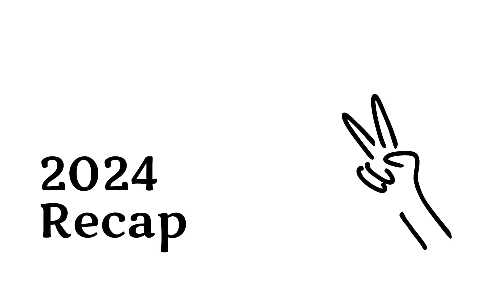

အမှန်တိုင်းပြောရရင် ၂၀၂၄ ခုနှစ်က ကျွန်တော့်အတွက် မလွယ်ကူခဲ့ပါဘူး။ အလုပ်အကိုင် အဆင်မပြေတာကြောင့်ရော အခြားကြောင့်ရော စိတ်ညစ်စရာအကြောင်းတွေ များခဲ့တယ်။ ဒါပေမယ့် အခြားသူတွေထက် ကျွန်တော်က "တော်သေးတယ်" လို့ထင်မိပါတယ်။ ဘာကြောင့်လဲဆိုတာ မသိပေမယ့်၊ ဒီနှစ်ဟာ ကျွန်တော့်ဝါသနာတွေကို energyအဖြစ် ပြောင်းလဲပေးခဲ့တဲ့ နှစ်တစ်နှစ်ပါ။

**Train Spotting**—ရထားဝါသနာအိုးလို့ ခေါ်ရမယ် ထင်တယ်။ ကျွန်တော်အတွက်တော့ ရထားနဲ့ပတ်သက်တာတွေက စိတ်အေးချမ်းစေတဲ့အပြင် စိတ်ဓာတ်တက်စေတဲ့ အရာတစ်ခု ဖြစ်လာခဲ့ပါတယ်။ ယခုနှစ်အတွင်း ရန်ကုန်၊ မန္တလေး၊ ရှမ်း (တောင်ပိုင်း)၊ တောင်ငူ၊ သထုံ၊ နဲ့ ပဲခူးတွေကို သွားရောက်ပြီး ရထားတွေ၊ ဘူတာတွေကို မှတ်တမ်းယူရင်း အတွေ့အကြုံတွေ စုနိုင်ခဲ့တယ်။ ဒီလိုခရီးတွေဟာ ကျွန်တော့်ကို သက်သာစေတဲ့ ခံစားချက်တစ်ခုထက် စိတ်ဓာတ်တက်စေတဲ့ အရာတစ်ခုအဖြစ် ပိုမိုခံစားစေခဲ့ရတယ်။

ဒီနှစ်ထဲ YouTube ချန်နယ်တစ််ခုလည်း စလုပ်ဖြစ်ခဲ့ပါတယ်။ မြန်မာနိုင်ငံမှာ ရထားနဲ့ပတ်သတ်တာ သေသေချာချာ promote လုပ်နိုင်ခဲ့တယ်လို့ ယုံကြည်ပါတယ်။ အရင်ကဆို RBE ရထားလို့သာ လူတွေသိတာကနေ ဒီဟာက KIHA11 , ဒီဟာက KIHA40 စသဖြင့် လူတွေပိုသိလာအောင် ပုံစံမျိုးစုံနဲ့ promote လုပ်နိုင်ခဲ့တယ် ထင်ပါတယ်။

မြန်မာပြည်က ရထားတွေ အကြောင်း သိချင်ရင် အချက်အလက်တွေ နည်းပါတယ်။ နိုင်ငံခြားက ရထားဝါသနာရှင်တွေ ရေးသားထားတဲ့ ဆောင်းပါးတွေကပဲ အများဆုံးဖတ်ရတာပါ။ ဒါကြောင့် ကျွန်တော့်လို ဝါသနာရှင်တွေ အတွက် ပြန်လည် မျှဝေပေးနိုင်ဖို့ရာ ဝက်ဆိုဒ်တစ်ခု လွှင့်တင်ဖို့လည်း စိတ်ကူးမိပါတယ်။

ဒါ့အပြင် လုံးဝမမျှော်လင့်ထားပဲ နိုင်ငံခြားက ရထားဝါသနာရှင်တစ်ဦးနဲ့ အပြင်မှာ ဆုံခဲ့ရပါတယ်။ သူနဲ့ ဆုံဖူးချင်ခဲ့တာပါ။ ဘာလိုဆို ဝီကီမှာ ကျွန်တော့် ရထားနဲ့ပတ်သတ်တဲ့ ဆောင်းပါးအတော်များများက သူ့ရဲ့ဆောင်းပါးတွေကနေပဲ ကိုးကားယူခဲ့ရတာပါ။ ဒီလိုတွေ့ဆုံမှုက ကျွန်တော်အတွက် အမှတ်တရတစ်ခုဖြစ်သလို၊ သူ့ရဲ့ အတွေ့အကြုံတွေက ကျွန်တော့်အတွက်တော့ သင်ယူစရာတချို့ရခဲ့ပြီး အမှတ်တရတစ်ခု ဖြစ်ခဲ့ပါတယ်။

ဒီနှစ်ထဲမှာ ကျွန်တော်ရဲ့ နည်းပညာပိုင်းမှာလည်း တိုးတက်မှုတစ်ခု ရခဲ့တယ်။ React နဲ့ React Native ကို အသစ်စတင်ပြီး လေ့လာခဲ့တယ်။ အခက်အခဲတွေနဲ့ ရင်ဆိုင်ရတဲ့အချိန်မှာ နည်းပညာအသစ်တွေကို လေ့လာတာဟာ ကျွန်တော့်အတွက် တိုးတက်မှုတစ်ခုအဖြစ် လုပ်နိုင်ခဲ့တာပါ။ Design Patterns တွေကို သေချာ လေ့လာဖို့ လိုနေသေးပေမယ့်၊ နောက်ထပ်နှစ်တွေမှာ ပိုမိုတိုးတက်အောင် ကြိုးစားမှာပါ။

ဩော် ... ဒါနဲ့ ကျွန်တော် ဒီနှစ်မှာ ကော်ဖီသောက်တာ လျော့နိုင်ခဲ့တယ်။ အရင်ကဆို တနေ့ သုံးခွက်/လေးခွက်ကနေ မနက်ပိုင်း တခွက်ပဲ သောက်နိုင်ခဲ့တယ်။ အစကတော့ မသောက်ရရင် ရင်တုန်တာတွေ ဖြစ်ခဲ့ပါတယ်။ နောက်ပိုင်းတော့လည်း အိုကေသွားတာပါပဲ။

၂၀၂၄ ဟာ အခက်အခဲတွေ များခဲ့ပေမယ့် ဝါသနာပါတာတွေ လုပ်နိုင်ခဲ့တဲ့ နှစ်တစ်နှစ်ပါ။

**ကျေးဇူးတင်ပါတယ် ၂၀၂၄။**

---