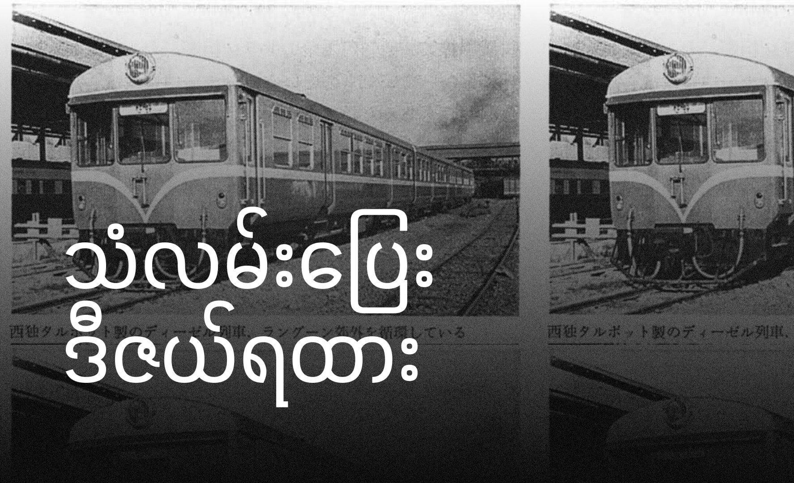

မြန်မာနိုင်ငံက ကိုလိုနီခေတ်ကနေ လွတ်လပ်ရေးရပြီးနောက်ပိုင်းမှာ ရန်ကုန်က ခရီးသွားပြည်သူတွေအတွက် ပိုမိုအဆင်ပြေချောမွေ့စေမယ့် ခေတ်မီသယ်ယူပို့ဆောင်ရေးစနစ်တစ်ခုကို တည်ဆောက်ဖို့ ကြိုးစားခဲ့ပါတယ်။ 

ရန်ကုန်မြို့ပတ်ရထားလမ်းမှာ ကိုလိုနီခေတ်ကနေ အသုံးပြုလာခဲ့တဲ့ ရေနွေးငွေ့စက်ခေါင်းတွေအစား ပိုမိုထိရောက်ပြီး ခေတ်မီတဲ့ ဒီဇယ်စက်ခေါင်းတွေကို အသုံးပြုဖို့ ဆုံးဖြတ်ခဲ့ပါတယ်။ အဲဒီအတွက် ၁၉၅၇ ခုနှစ်မှာ အနောက်ဂျာမဏီနိုင်ငံက Talbot ကုမ္ပဏီက ထုတ်လုပ်တဲ့ မြင်းကောင်ရေ ၇၀၄ ရှိတဲ့ ဒီဇယ်ရထား (DMU) ၈ စီးကို စတင်မှာယူခဲ့ပါတယ်။

အဲဒီဒီဇယ်ရထားတွေကို ၁၉၅၉ ခုနှစ် သြဂုတ်လ ၉ ရက်နေ့မှာ ရန်ကုန်ဆင်ခြေဖုံးရထားလမ်းပိုင်းတွေမှာ စတင်အသုံးပြုခဲ့ပါတယ်။ ဒီအချိန်မှာ ရန်ကုန်မြို့ပတ်ရထားလမ်းက ချိတ်ဆက်မပြီးသေးတာကြောင့် ၁၉၅၈ ခုနှစ် ဒီဇင်ဘာလ ၁၀ ရက်နေ့မှ စတင်ပြီး ဗိုလ်ချုပ်ကြီးနေဝင်းရဲ့ အိမ်စောင့်အစိုးရလက်ထက်မှာ တညင်းကုန်းဘက်ခြမ်းနဲ့ မင်္ဂလာဒုံဘက်ခြမ်းဆိုပြီး နှစ်ဖွဲ့ခွဲပြီး ဖောက်လုပ်ခဲ့ပါတယ်။ ၁၉၅၉ ခုနှစ် မတ်လ ၁၉ ရက်နေ့မှာတော့ အဲဒီရထားလမ်းတွေကို အောင်မြင်စွာ ချိတ်ဆက်နိုင်ခဲ့ပါတယ်။

ရန်ကုန်မြို့တစ်ပတ် စီးနင်းခအဖြစ် ၁ ကျပ်နဲ့ ၂၀ ပြား ကျသင့်ခဲ့ပြီး ရန်ကုန်လေဆိပ်အနီးအနားမှာ မင်္ဂလာဒုံကန်တိုမင်နဲ့ လေဆိပ်ဘီအေအက်ဖ် ဘူတာသစ်တွေ ပေါ်ပေါက်လာခဲ့ပါတယ်။

ရထားလမ်းတွေ ချိတ်ဆက်ပြီးနောက်ပိုင်းမှာ စီးနင်းသူတွေ များလာတာကြောင့် အစီးရေ ၈ စီးနဲ့ မလုံလောက်တော့ဘဲ နောက်ထပ် ၄ စီးကို ၁၉၆၁ ခုနှစ်မှာ ထပ်မံဝယ်ယူခဲ့ပါတယ်။ အဲဒီရထားတွေကို ပြုပြင်ထိန်းသိမ်းဖို့အတွက် အင်းစိန်မှာ သံလမ်းပြေးဒီဇယ်စက်ခေါင်းစက်ရုံသစ်တွေကိုလည်း တည်ဆောက်ခဲ့ပြီး ၁၉၆၅ ခုနှစ် စက်တင်ဘာလမှာ ဖွင့်လှစ်ခဲ့ပါတယ်။

အဲဒီခေတ်က ဒီဇယ်ရထားတွေက တစ်စီးမှာ သုံးတွဲပါဝင်ပြီး တွဲတိုင်းမှာ ပန်ကာ၊ ဆိုဖာထိုင်ခုံတွေနဲ့ အလိုအလျောက် တံခါးဖွင့်စနစ်တွေ ပါရှိတဲ့ ခေတ်မီရထားတွေ ဖြစ်ခဲ့ပါတယ်။ ဒါပေမယ့် နောက်ပိုင်းမှာ တွဲဆိုင်းသစ်တွေ၊ အပိုပစ္စည်းတွေကို ထပ်မံဖြည့်တင်း ပေးနိုင်ခြင်း မရှိတော့ဘဲ အင်ဂျင်နဲ့ ပြတင်းပေါက်တွေကို ဖယ်ရှားခဲ့ရကာ စက်ခေါင်းဆွဲ လူစီးရထားတွေအဖြစ် ပြောင်းလဲ တည်ဆောက်ခဲ့ရပါတယ်။

၂၀၁၅ ခုနှစ် နောက်ပိုင်းကစပြီးတော့ အဲဒီရထားတွေအစား ဂျပန်နိုင်ငံက KIHA အမျိုးအစား ဒီဇယ်ကားရထားတွေနဲ့ တဖြည်းဖြည်း ပြောင်းလဲပြေးဆွဲလာခဲ့ပါတယ်။