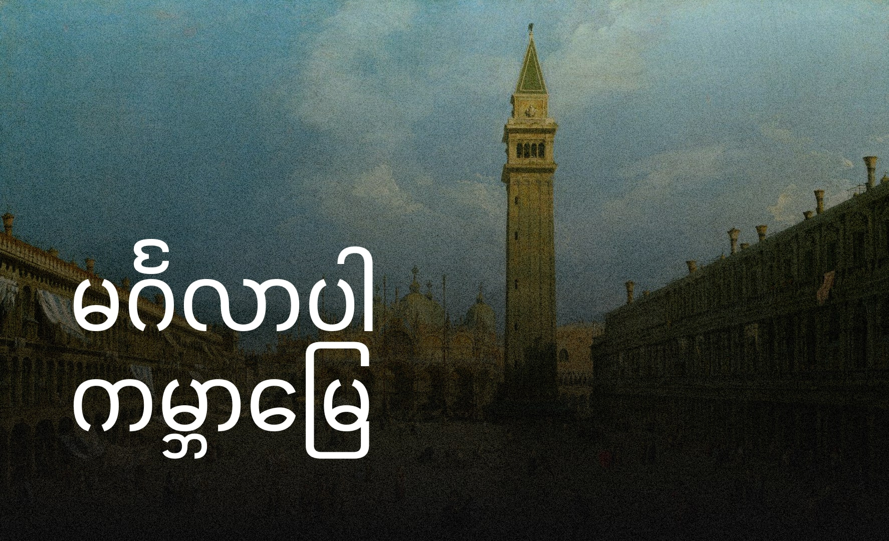

၂ နှစ်အတွင်း ပထမဆုံးအကြိမ်အဖြစ် ကျွန်တော့် website ကို ပြန်လည်မွမ်းမံလိုက်ပါပြီ။ 

အရင်က 11ty ကို အသုံးပြုထားပေမယ့် [ကိုထိန်ရဲ့ blog](https://saturngod.net/) ကိုဖတ်ရင်း Astro ကို စိတ်ဝင်စားသွားတာကြောင့် ဒီတစ်ခေါက်မှာ Astro ကိုသုံးဖြစ်ပါတယ်။ သူတို့နှစ်ခုစလုံးက markdown based ပဲဆိုတော့ migrate လုပ်ရတာလွယ်ကူပါတယ်။

ဒီဇိုင်းကတော့ ပြန်ရေးရမှာ စိတ်မပါတာမလို့ Astro မှာရှိတဲ့ Themeတွေကိုပဲ သုံးဖို့ ဆုံးဖြတ်ခဲ့ပါတယ်။ MaeWolff ရဲ့ [Astro Portfolio Template](https://github.com/MaeWolff/astro-portfolio-template) ကို အကြိုက်တွေ့သွားတာကြောင့် အဲဒါကို အခြေခံပြီး ကျွန်တော့်စတိုင်လေးနဲ့ ပြင်ဆင်ထားပါတယ်။ တစ်နေ့လောက်ပဲ အချိန်ပေးလိုက်ရပါတယ်။ အတော် သဘောတွေ့နေတာပါ။

စာရေးဖို့အတွက်ကိုတော့ Obsidian ပဲဆက်သုံးလိုက်ပါတယ်။

အရင် 11ty သုံးတုန်းကလည်း Notion မှာရေးထားတဲ့ content တွေကို HTML ဖိုင် export လုပ်ပြီး CSS ကုဒ်လေး ဆယ်ကြောင်းလောက်နဲ့ ပြင်ခဲ့ရတာကို ပြန်သတိရမိပါတယ်။

ဒီဆိုဒ်လေးမှာတော့ ကျွန်တော်ရဲ့ ဘာရယ်မဟုတ် စာတိုလေးတွေ၊ စိတ်ကူးပေါက်ရာလေးတွေ ရေးတင်ဖို့ စဥ်းစားထားပါတယ်။

---

