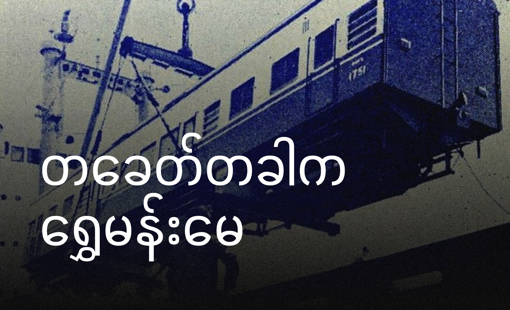

မြန်မာ့လွတ်လပ်ရေးရပြီးနောက်ပိုင်း၊ အဝေးပြေးလမ်းတွေနဲ့ အဝေးပြေးကားတွေ မတွင်ကျယ်သေးတဲ့ကာလမှာ မြန်မာပြည်ရဲ့ အဓိက ခရီးသွားသယ်ယူပို့ဆောင်ရေးကတော့ မီးရထားပဲ ဖြစ်ပါတယ်။ အထူးသဖြင့် ရန်ကုန်နဲ့ မန္တလေးကို ချိတ်ဆက်ပေးတဲ့ မီးရထားခရီးစဉ်ကတော့ ခရီးသွားတွေအတွက် အတော်လေးကို လူကြိုက်များခဲ့ပါတယ်။ အဖြူအမဲ ရုပ်ရှင်တစ်ခုမှာ မန္တလေးကိုပြန်လာမည့် သမီးကို အမေဖြစ်သူက မီးရထားနဲ့ပဲ ပြန်လာဖို့ မော်တော်ကားထက်စိတ်ချရကြောင်း ပြောတာတွေတောင် တွေ့ရပါတယ်။

အဲဒီခေတ်က အမှတ်(၁)နဲ့(၂) မီးရထားတွေကို လူတွေက ဒဂုံမေနဲ့ ရွှေမန်းမေလို့ ချစ်စနိုးနဲ့ ခေါ်ကြပါတယ်။ ဒဂုံမေက ရန်ကုန်ကနေ မန္တလေးကို သွားတဲ့ ရထားဖြစ်ပြီး၊ ရွှေမန်းမေက မန္တလေးကနေ ရန်ကုန်ကို ပြန်လာတဲ့ ရထားပါ။ ဒီနာမည်လေးတွေကလည်း ခေတ်ကာလနဲ့အညီ လွန်ခဲ့တဲ့ နှစ်ပေါင်းများစွာကတည်းက ဒီထိတိုင် လူတွေရဲ့ အတွေးထဲမှာ မြင်ယောင်နေတဲ့ မြန်မာ့ရထားရဲ့ သမိုင်းတစ်ခုလိုပါပဲ။

၁၉၅၄ ခုနှစ်နောက်ပိုင်း မြန်မာပြည်မီးရထားအနေနဲ့ အထက်တန်းခရီးသည်များ သက်သာချောင်ချိစေရန်နှင့် သက်တောင့်သက်သာ ဖြစ်စေရန် ရည်ရွယ်ပြီး လူစီးတွဲသစ်များကို စစ်လျော်ကြေးများဖြင့် ဂျပန်နိုင်ငံကနေ မှာယူခဲ့ကာ အများစုမှာ ဟီတာချီ ကုမ္ပဏီက တည်ဆောက်ခဲ့ခြင်းဖြစ်ပါတယ်။

ဒီလူစီးတွဲသစ်တွေကို ရန်ကုန်-မန္တလေး ခရီးစဉ်တွေမှာ အသုံးပြုခဲ့ပြီး၊ ဒဂုံမေနဲ့ ရွှေမန်းမေ နာမည်တွေကိုလည်း ဒီလူစီးတွဲသစ်တွေမှာ ချိတ်ဆွဲထားခဲ့ပါတယ်။ ဒီလူစီးတွဲသစ်တွေက ကတီပါဖုံးတွေ၊ အိပ်ရာထိုင်ခင်းတွေ၊ အရောင်အသွေးလှလှတဲ့ အတွင်းပိုင်း ဒီဇိုင်းတွေနဲ့ ခရီးသွားတွေကို အတော်လေး သက်တောင့်သက်သာဖြစ်စေခဲ့ပါတယ်။

၁၉၆၀ ခုနှစ် ရထားချိန်စာရင်းများအရ မန္တလေးမှ 20:30 တွင် ထွက်ခွာပြီး ရန်ကုန်ကို နောက်တစ်နေ့မွန်းတည့် 12:58 တွင် ဆိုက်ရောက်ခဲ့ပါတယ်။ခရီးစဉ်အစအဆုံး အထက်တန်း ၄၈ ကျပ်ပြား ၇၀ နှင့် ရိုးရိုးတန်း ၁၇ ကျပ်ပြား ၅၀ ကျသင့်ပါတယ်။ခရီးသည်များအနေနဲ့ လက်မှတ်များကို ၇၂နာရီ ကြိုတင်ဝယ်ယူခဲ့နိုင်ပြီး သီးသန့်ခဆိုပြီး အိပ်စင်အတွက် ၁၂ ကျပ်နှင့် ထိုင်ခုံအတွက် ၃ ကျပ် ထပ်ဆောင်း ကျသင့်ပါတယ်။

စာပို့ရထားတွင် ရိုးရိုးတန်း၊ အထက်တန်း၊ အထက်တန်းအိပ်စင်တွဲ နှင့်စားသောက်တွဲများပါဝင်ပြီး ၁၉၅၇ခုနှစ်တွင် ရွှေညောင်နှင့် မြင်းခြံခရီးသည်များအတွက်လည်း လမ်းခွဲဘူတာမှာ ရထားတွဲပြောင်းစီးရန် မလိုအပ်တဲ့ တောက်လျှောက်တွဲများ ထပ်မံ ချိတ်ဆွဲပြေးဆွဲခဲ့ပါတယ်။

ရထားနာမည်နဲ့ ရုပ်ရှင်လည်းထွက်ခဲ့ပါတယ်။ အချစ်ဟာသဇာတ်လမ်းပါ။ ဒီရုပ်ရှင်ထဲက အဆိုတော် မာမာအေး သီဆိုတဲ့ ရွှေမန်းမေသီချင်းမှာလည်း အောင်မြင်ခဲ့ပါတယ်။ နောက်ပိုင်း သက်ဆိုင်ရာဌာနမှ တေးရေးဆရာ ရွှေပြည်အေးအား ရထားအတွက် သီချင်းအပ်ခဲ့ပြီး ရွှေမန်းမေ သီချင်းကို ခင်ယုမေ နှင့် ပြန်လည်အသံသွင်းစေခဲ့ပါတယ်။

ခင်ယုမေ ပြန်လည်သီဆိုတဲ့ သီချင်းတွင် မီးရထားသံများကို သီချင်းသံစဉ်နှင့်အညီ ထည့်သွင်းတီးမှုတ်ခဲ့ပြီး၊ ရွှေမန်းမေ မီးရထားကြီး ခုတ်မောင်းစဉ် ဖွင့်ခဲ့ပြီး ရွှေမန်းမေသီချင်း မူရင်းသီဆိုသူကိုလည်း ခင်ယုမေဟုပင် ထင်မှတ်ခဲ့ကြသည်အထိ လူကြိုက်များကာ အောင်မြင်ကျော်ကြားခဲ့ပါတယ်။

ဒဂုံမေ/ရွှေမန်းမေ စာပို့ရထား လူစီးများလာသဖြင့် ၁၉၅၇ ခုနှစ် ဇွန်လ ၁၇ရက်နေ့တွင် ဒဂုံညွန့်/ရွှေမန်းညွန့်ရထားများကိုလည်း ထပ်တိုးမိတ်ဆက်ခဲ့ပါတယ်။နောက်ပိုင်းတွင် ဒဂုံညွန့်/ရွှေမန်းညွန့်ရထားများက အသစ်ရောက်လာတဲ့ အဲလ်စသွန် ဒီဇယ်လျှပ်စစ်စက်ခေါင်းဖြင့် ပြေးဆွဲပြီး မြန်မာ့မီးရထားရဲ့ ပထမဆုံးသော အမြန်ရထားများ ဖြစ်လာခဲ့ပါတယ်။

ရွှေမန်းမေ နှင့် ဒဂုံမေ စာပို့ရထားများဟာ တခေတ်တခါက မြန်မာ့မီးရထား၏ နာမည်ကြီး ပထမတန်းဝင်ရထားများဖြစ်ခဲ့ပြီး ယနေ့တိုင် ရွှေမန်းမေသီချင်းနှင့်အတူ အမှတ်ရနေကြဆဲ ဖြစ်ပါတယ်။

---

