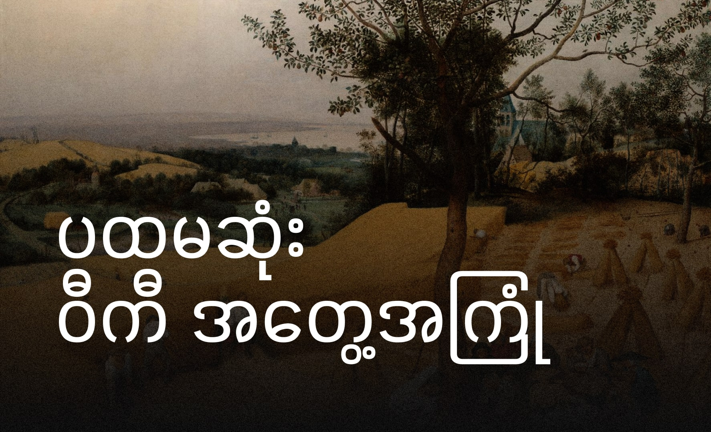

ဝီကီတွေကို ကျွန်တော် အမြဲစိတ်ဝင်စားခဲ့ပါတယ်။ သူတို့ဟာ သတင်းအချက်အလက်တွေကို မျှဝေဖို့နဲ့ တခြားသူတွေနဲ့ ပူးပေါင်းဆောင်ရွက်ဖို့ အတွက် တကယ်ကောင်းတဲ့နည်းလမ်းတစ်ခုလိုပါတယ်။ ဒါကြောင့် ကျွန်တော့ရဲ့ပထမဆုံးဝီကီဆောင်းပါးကို တီထွင်ဖို့ ဆုံးဖြတ်ခဲ့ပါတယ်။

ကျွန်တော်စိတ်ဝင်စားတဲ့ ခေါင်းစဉ်ကို ရွေးချယ်ခဲ့ပါတယ်။ ကျွန်တော်ရဲ့ အကြိုက်ဆုံးအစားအစားဖြစ်တဲ့ မြန်မာရိုးရာ မုန့်လက်ဖက်ခြောက်ကို ဆောင်းပါးရေးဖို့ ဆုံးဖြတ်ခဲ့ပါတယ်။ ကျွန်တော်သုတေသနလုပ်ပြီး ကျွန်တော့ဆောင်းပါးကို ရေးခြင်းကို စတင်ခဲ့ပါတယ်။

ဒါဟာ ကျွန်တော်ထင်ထားသည်ထက် ပိုလွယ်ပါတယ်။ ကျွန်တော်အချက်အလက်တွေကို ထည့်ရိုက်ပြီး ကျွန်တော့ဆောင်းပါးကို သိမ်းဆည်းခဲ့ပါတယ်။ ကျွန်တော့ဆောင်းပါးကို ဝီကီမှာ ထုတ်ဝေထားတာကို ကျွန်တော် အင်မတော်မသာပျော်ရွှင်ခဲ့ပါတယ်။

ကျွန်တော့ရဲ့ပထမဆုံးဝီကီအတွေ့အကြုံကနေ ကျွန်တော် အများကြီးလေ့လာရခဲ့ပါတယ်။ သုတေသနလုပ်ပုံ၊ ရှင်းလင်းစွာရေးပုံနဲ့ တခြားသူတွေနဲ့ ပူးပေါင်းဆောင်ရွက်ပုံတွေကို လေ့လာရခဲ့ပါတယ်။ ဝီကီတွေဟာ သင်္ခန်းစာကိုကမ္ဘာကြီးနဲ့ မျှဝေဖို့ အတွက် ကောင်းတဲ့နည်းလမ်းတစ်ခုလည်းဖြစ်တယ်။

ဝီကီဆောင်းပါးကို ဖန်တီးဖို့ စိတ်ဝင်စားနေတဲ့ သူတိုင်းကို ကျွန်တော် အကြံပြုချင်ပါတယ်။ ဒါဟာ ပျော်ရွှင်ဖွယ်ကောင်းပြီး အကျိုးရှိတဲ့ အတွေ့အကြုံပါပဲ။

---

