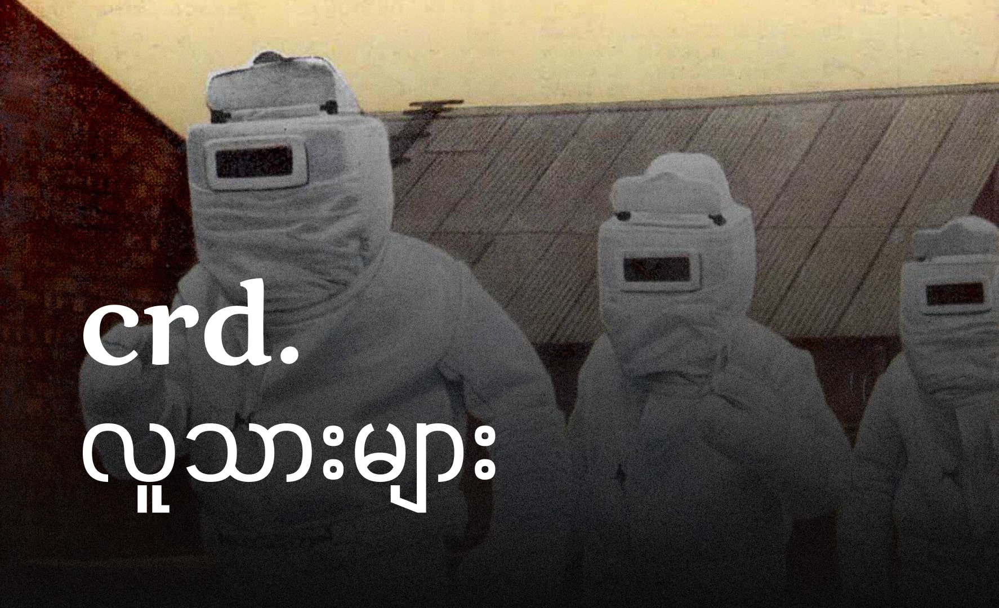

ကိုယ်တိုင်ရိုက်ထားတဲ့ ဓာတ်ပုံတစ်ပုံကို အခြားသူတွေက အသုံးပြုနေတာကို တွေ့မိရင် ကိုယ့်ရဲ့ ဓာတ်ပုံလေးက တခြားသူတွေအတွက် အသုံးဝင်နေတာကို တွေ့ရတာမလို့ ဝမ်းသာရပါတယ်။ ဒါပေမယ့် မူလပိုင်ရှင်ဖြစ်တဲ့ ကိုယ့်ကို မဖော်ပြထားပဲ အခြားသူရဲ့နာမည် ဒါမှမဟုတ် "crd" ဆိုတာကြီးနဲ့ အဆုံးသတ်ထားတာကို မြင်ရတဲ့အခါမှာတော့ စိတ်မကောင်းဖြစ်မိပါတယ်။

ကိုယ်ပိုင်ရိုက်ထားတဲ့ ဓာတ်ပုံတွေကို ဝီကီပီဒီးယား စတဲ့ ပညာရေးဆိုင်ရာ ဝက်ဘ်ဆိုက်တွေမှာ CC BY-SA 3.0 လိုင်စင်နဲ့ လှူဒါန်းလေ့ရှိပါတယ်။ ဒါကလည်း ဆောင်းပါးတွေကို ပိုပြီး စုံလင်စေချင်တဲ့ စိတ်နဲ့ ကိုယ်တတ်နိုင်တဲ့ဘက်ကနေ မျှဝေချင်တဲ့ စိတ်ရင်းကြောင့်ပါ။

တချို့ပုံတွေကို သတင်းဆောင်းပါးတွေ၊ လူမှုကွန်ယက်တွေနဲ့ တီဗီက သတင်းတွေမှာ ပြန်တွေ့ရတာမျိုးလည်း ရှိပါတယ်။ သတင်းဌာနကြီးတွေကတော့ ဓာတ်ပုံရဲ့ မူလပိုင်ရှင်ကို သေသေချာချာ ဖော်ပြတတ်ပေမယ့် တချို့ကတော့ အဲ့လိုမဟုတ်ပါဘူး။ ကိုယ်က ဓာတ်ပုံကို အခမဲ့ လှူဒါန်းထားတာဖြစ်လို့ ဘယ်လိုပဲ သုံးသုံး ကိစ္စတော့ မရှိပါဘူး။

ဒါပေမယ့် CC လိုင်စင်နဲ့မဟုတ်တဲ့ ဓာတ်ပုံနဲ့ ဗီဒီယိုတွေကို တခြားသူက "crd" ဆိုတာကြီးနဲ့ ပြန်တင်ထားတာကတော့ တစ်မျိုးကြီးပါပဲ။

"crd" ဆိုတာက ပုံမှန်အားဖြင့် "credit" လို့ ဖတ်ပြီး မူလပိုင်ရှင်ကို ရည်ညွန်းတဲ့အနေနဲ့ သုံးတာပါ။ ဒါပေမယ့် တကယ်တော့ မူလပိုင်ရှင်ရဲ့ အမည် ဒါမှမဟုတ် ဓာတ်ပုံရဲ့ မူလအရင်းအမြစ်ကို ပြည့်စုံစွာ ဖော်ပြထားတာ မဟုတ်ပါဘူး။

**အခြားသူတွေရဲ့ အမြင်**

ဒီကိစ္စနဲ့ပတ်သက်ပြီး အခြားသူတွေက ဘယ်လို အမြင်ရှိကြမလဲဆိုတာလည်း စိတ်ဝင်စားစရာပါ။ တချို့ကတော့ ကိုယ့်ရဲ့ ဓာတ်ပုံကို အခမဲ့ လှူဒါန်းထားတာဆိုတော့ ဘယ်လိုပဲ သုံးသုံး ပြဿနာမရှိဘူးလို့ ထင်ကောင်းထင်မှာပါ။ ဒါပေမယ့် တချို့ကတော့ မူလပိုင်ရှင်ကို ဖော်ပြဖို့က "crd" လိုရေးလိုက်တာနဲ့ လုံလောက်ပြီးလို့လည်း ထင်ကောင်းထင်မှာပါ။

**အဖြေရှာဖွေမှု**

ဒီကိစ္စနဲ့ပတ်သက်ပြီး ပိုပြီး တိကျတဲ့ အဖြေတစ်ခုကို ရှာဖွေဖို့ဆိုတာ ခက်ခဲပါတယ်။ ဘာကြောင့်လဲဆိုတော့ ဒီမှာက လိုင်စင်တွေ မူပိုင်ခွင့်တွေနဲ့ ပတ်သတ်ပြီး သိပ်ပြီး မသိရှိကြတာလည်း ပါတယ်။ ကျွန်တော်တောင် ဝီကီရေးမှာပဲ မူပိုင်ခွင့်ရ ဓာတ်ပုံတွေကို ဘယ်လိုမျိုး မျှဝေရမလဲ ဆိုတာသိတာပါ။

**တိုက်တွန်းချင်တာက**

ကိုယ့်ရဲ့ မျှဝေတဲ့ နေရာမှာ "crd" ဆိုတဲ့အစား မူလဖန်တီးသူရဲ့ အမည် ဒါမှမဟုတ် မူရင်းလင့်လေး ထည့်သွင်းပေးရင် အကောင်းဆုံးဖြစ်မယ်လို့ ထင်မြင်မိပါတယ်။

---

