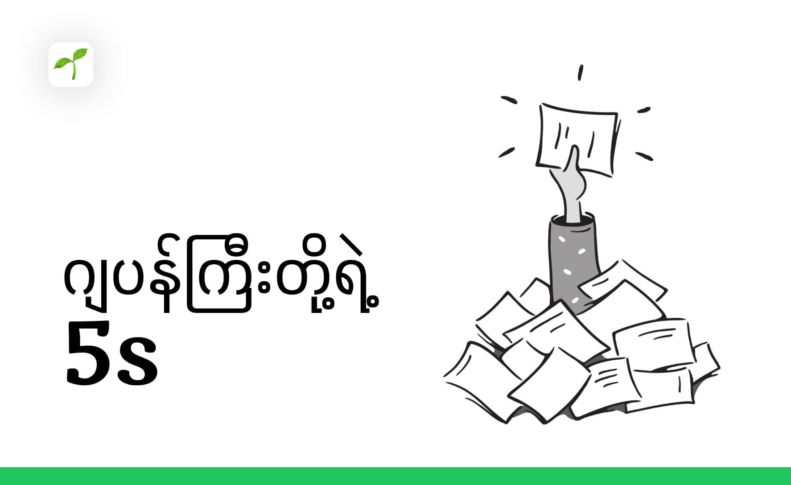

ကျွန်တော်တို့ လူတိုင်းလိုပဲ ကျွန်တော်လည်း Computer ထဲမှာ ဖိုင်တွေ အများကြီး ရှိကြပါတယ်။ တစ်ခါတလေ လိုအပ်တဲ့ ဖိုင်တစ်ခုကို ရှာရင် တစ်နေကုန်လိုလို အချိန်ကုန်သွားတာမျိုးတွေ ခံစားဖူးမှာပါ။ ဖိုင်တွေက ဘယ်မှာရှိမှန်း မသိတော့ တစ်ခါတလေ ဒီဖိုင် ဖျက်မိသွားလားဆိုတာတောင် သံသယဝင်မိရပါတယ်။ ဒီလိုပြဿနာတွေကို ဖြေရှင်းဖို့ ကျွန်တော် ဂျပန် 5S နည်းစနစ်နဲ့ စမ်းကြည့်ပါတယ်။

**5S ဆိုတာ ဘာလဲ?**

5S ဆိုတာ ဂျပန်စကားလုံး 5 လုံးကို အခြေခံထားတဲ့ စနစ်တစ်ခုပါ။ ဒါတွေကို ကျွန်တော်တို့ Computer ဖိုင်တွေကို စီမံခန့်ခွဲဖို့လည်း အသုံးပြုနိုင်ပါတယ်။

### 1. Seiri (整理) - လိုအပ်တာတွေကိုသာ ထားခြင်း

> [!NOTE]
>  **ဖိုင်တွေကို စနစ်တကျ သန့်ရှင်းရေးလုပ်ပါ**
>  **မလိုအပ်တဲ့ ဖိုင်တွေကို ဖျက်ပစ်ပါ**
>  **အရေးကြီးတဲ့ ဖိုင်တွေကို တစ်နေရာတည်းမှာ စုစည်းပါ**

ပထမဆုံး ကျွန်တော်ဖိုင်တွေကို အမျိုးအစားလိုက် ခွဲထုတ်လိုက်ပါတယ်။ ပုံတွေကို Images folder ထဲ၊ PDF တွေကို Documents folder ထဲ စသဖြင့် ဖိုင်အမျိုးအစားတစ်ခုချင်းစီအတွက် အထူး Folder တွေဖန်တီးပြီးတော့ သုံးခဲ့တယ်။

### 2. Seiton (整頓) - နေရာတကျ ထားခြင်း

> [!NOTE]
> **ဖိုင်တွေကို အမျိုးအစားအလိုက် folder တွေ ဖန်တီးပါ** 
> **ဖိုင်တစ်ခုစီကို သဘောကျတဲ့ အမည်ပေးပါ**
> **ဖိုင်တွေကို နေ့စွဲအလိုက်၊ ပရောဂျက်အလိုက် ခွဲလိုက်ပါ**

Folder တွေကိုတော့ အဓိက Category လိုက်စီဆောင်ပြီး Subfolder တွေ သတ်မှတ်လိုက်ပါတယ်။ ဥပမာ – Project files အတွက် “Work” folder ထဲမှာ စီထားပြီးတော့ Client A, Client B ဆိုပြီး Subfolder တွေထပ်ထည့်ခဲ့တယ်။ ပုံတွေဆိုလည်း ခုနှစ် folder လအလိုက် subfolder ခွဲလိုက်ပါတယ်။ အကယ်၍ ကိုယ်တိုင် manual မလုပ်ချင်ရင် [ဒီ script](https://shinkhantmaung.pages.dev/writings/Organizing%20Files%20by%20Year%20and%20Month%20with%20a%20Simple%20Bash%20Script/) ကို run လိုက်ရင် ရပါတယ်။

### 3. Seiso (清掃) - သန့်ရှင်းရေးလုပ်ခြင်း

> [!NOTE]
> **ဖိုင်တွေကို ပုံမှန် စစ်ဆေးပါ**
> **မလိုအပ်တဲ့ ဖိုင်တွေကို ဖျက်ပစ်ပါ** 
> **ဖိုင်တွေကို နေ့စဉ် Back Up လုပ်ပါ**

### 4. Seiketsu (清潔) - စနစ်တကျ ထိန်းသိမ်းခြင်း

> [!NOTE]
> **ဖိုင်စနစ်ကို ပုံမှန် ပြန်လည်သုံးသပ်ပါ**
> **လိုအပ်ရင် ဖိုင်စနစ်ကို ပြင်ဆင်ပါ**

နောက်ပိုင်းမှာတော့ ဖိုင်နာမည်တွေအတွက်စည်းမျဉ်းထားလိုက်ပါတယ်။ ပုံတွေအတွက်ဆိုရင် ဘယ်လို project တွေအတွက် ဘယ်လိုဆိုပြီးတော့ ပါ။ ပုံတွေဆိုရင်လည်း "YYYY-MM-DD" လို့ တပ်ပြီးတော့ ရှာဖွာရတာ လွယ်ကူသွားတယ်။

### 5. Shitsuke (習慣) - ဓလေ့ဖြစ်စေခြင်း

- ဖိုင်တွေကို စနစ်တကျ သိမ်းဆည်းတဲ့ အလေ့အကျင့်ကို နေ့စဉ်လုပ်ဆောင်ပါ။

ကျွန်တော် ဒီ 5S နည်းစနစ်ကို ကျွန်တော့် Computer ထဲက ဖိုင်တွေကို စီမံခန့်ခွဲဖို့ အသုံးပြုကြည့်တဲ့အခါ တကယ်ကို အကျိုးရှိတယ်ဆိုတာ သိလိုက်ရပါတယ်။ အရင်က တစ်နေကုန် ရှာနေရတဲ့ ဖိုင်တွေကို ခဏလေးနဲ့ ရှာတွေ့နိုင်တော့တယ်။

ဒီ 5S နည်းစနစ်က တကယ်ကို အသုံးဝင်တဲ့ နည်းစနစ်တစ်ခုပါ။ ကျွန်တော်တို့ လူတိုင်း ဒီနည်းစနစ်ကို အသုံးပြုပြီး ကျွန်တော်တို့ရဲ့ Computer ဖိုင်တွေကို စနစ်တကျ စီမံခန့်ခွဲနိုင်ရင် အချိန်တွေကို သက်သာစေနိုင်မှာပါ။

အားလုံးပဲ အဆင်ပြေနိုင်ကြပါစေ။

---

